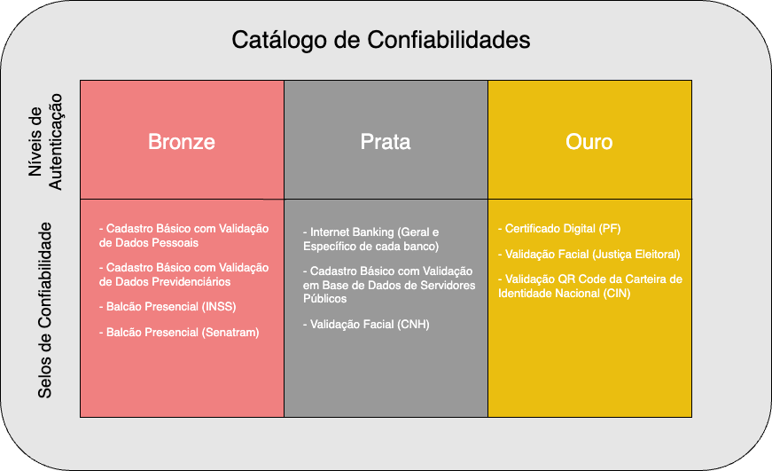
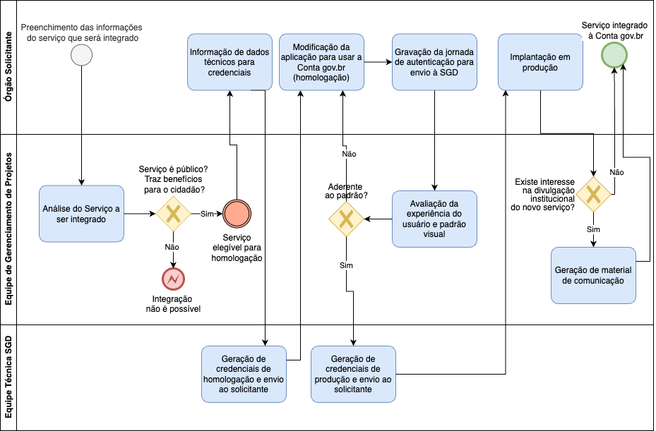
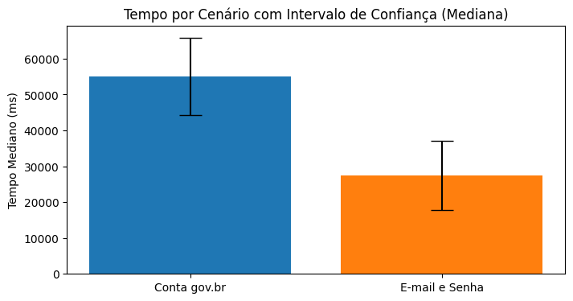
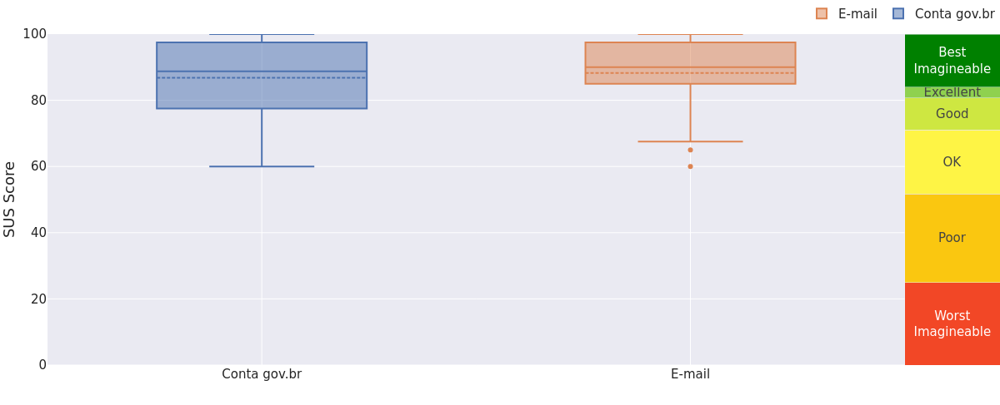

# Guia Prático para Adoção da Conta gov.br

**Autor:** Demétrius de Almeida Jubé

## 1. Apresentação
Este guia tem como objetivo apoiar gestores públicos na avaliação da viabilidade e pertinência de integrar sistemas e serviços à plataforma de Login Único do Governo Federal, conhecida como **Conta gov.br**.

## 2. Entendendo a Conta gov.br

### O que é
A Conta gov.br é um mecanismo de autenticação digital único, instituído pelo [Decreto 8.936/2016](https://www.planalto.gov.br/ccivil_03/_Ato2015-2018/2016/Decreto/D8936.htm)[1], que tem como objetivo simplificar e padronizar o acesso do cidadão a serviços públicos digitais. Mantida pela [Secretaria de Governo Digital](https://www.gov.br/governodigital/pt-br/estrategias-e-governanca-digital/secretaria-de-governo-digital), a solução adota o conceito de Login Único (_Single Sign-On_), oferecendo aos sistemas que a integrarem funcionalidades de autenticação (verificação da identidade do usuário) e autorização (controle de permissões de acesso).

### Problemas que resolve

A Conta gov.br endereça desafios estruturais comuns nos serviços públicos digitais [2], como:

#### Múltiplas formas de login e autenticação
 A ausência de uma forma padronizada de autenticação obriga cada órgão a manter sua própria solução de autenticação e autorização, incluindo o armazenamento dos dados pessoais e das credenciais dos usuários. Essa fragmentação, além de gerar riscos institucionais relacionados à gestão dessas informações sensíveis, também expõe o cidadão à Fadiga da Autenticação [3] — um fenômeno em que a multiplicidade de logins e senhas para diferentes serviços leva à adoção de comportamentos inseguros, como o uso de senhas fracas ou repetidas. Esses hábitos comprometem diretamente a segurança do ambiente digital.

#### Inconsistência cadastral entre serviços
O uso de serviços públicos digitais pode demandar uma acurácia maior nos dados cadastrais de quem os utiliza, uma vez que podem envolver acesso a dados sensíveis, como informações fiscais e trabalhistas. Dessa forma, ao utilizar uma solução que garante a consistência das informações, o órgão assegura maior confiabilidade ao processo, reduzindo o risco de fraudes e melhorando a qualidade do atendimento.

#### Falta de integração entre sistemas públicos
Ao compartilharem o mesmo sistema de autenticação, diferentes serviços públicos digitais podem oferecer uma experiência mais fluida ao cidadão, que poderá transitar entre um e outro sem ter uma nova etapa de autenticação, o que melhora a usabilidade e fortalece a percepção de integração entre os serviços do Estado.

Juntas, essas melhorias contribuem para um ecossistema digital mais seguro, eficiente e centrado no cidadão.

### Conceitos-chave
Para garantir uma autenticação segura e adaptada à diversidade dos serviços públicos digitais, a Conta gov.br é estruturada a partir de conceitos que permitem modular o acesso e a confiabilidade das informações. Os principais elementos que compõem essa arquitetura serão mostrados a seguir:
- **Selos de Confiabilidade**: Indicam a origem e segurança do processo de verificação dos dados, indicando se o procedimento foi feito por uma instituiição bancária ou pela Justiça Eleitoral, por exemplo.
- **Níveis de Autenticação**: Definidos em Bronze, Prata e Ouro, essa informação varia de acordo com o Selo de Confiabilidade de quem verificou as informações. Quanto mais seguro for o Selo, maior o Nível fornecido ao usuário.
- **Catálogo de Confiabilidades**: Estrutura que permite personalizar a experiência do usuário com base nos Selos e Níveis disponíveis.

A Figura 1 apresenta a representação gráfica dessa arquitetura:

> 
> 
> *Figura 1 - Catálogo de Confiabilidades da Conta gov.br*

De forma geral, o Nível de Autenticação atribuído a uma Conta gov.br é determinado pelo grau de verificação realizado no momento do cadastro e em etapas subsequentes. Quanto maior o Nível, maior a confiança na identidade do usuário, permitindo o acesso a serviços públicos mais sensíveis. Essas informações ficam disponíveis por meio de *endpoints* que podem ser utilizados pelas aplicações integradas para adaptar a experiência do usuário, restringindo ou liberando funcionalidades conforme o Nível de Autenticação identificado.


## 3. Critérios de Uso 
Nem toda solução está apta a ser integrada com a Conta gov.br. Há critérios que devem ser satisfeitos e são avaliados no momento do pedido de adesão.

### ✅ Requisitos de Elegibilidade para Integração

Para que um sistema possa ser integrado à Conta gov.br, é necessário que:

- 🏛️ **Seja caracterizado como um serviço público**, ou seja, uma ação realizada por órgãos ou entidades da administração pública para atender demandas da sociedade no exercício de direitos ou no cumprimento de deveres (Decreto nº 8.936/2016, art. 2º, inciso I).

- 💻 **Se enquadre como um serviço público digital**, ou seja, prestado por meio eletrônico, sem a necessidade de atendimento presencial (Decreto nº 8.936/2016, art. 2º, inciso II).

- 🧩 **Esteja sob responsabilidade de um ente público habilitado**, como:
  - Órgãos da administração pública direta, autárquica ou fundacional.
  - Empresas públicas da União, Estados ou Municípios.

- 🧾 **Tenha a solicitação formalizada por um agente público ou gestor responsável pelo serviço**.

- 🏙️ **No caso de prefeituras**, é necessário que o município tenha formalizado sua adesão à **Rede Nacional de Governo Digital ([Rede gov.br](https://www.gov.br/governodigital/pt-br/estrategias-e-governanca-digital/rede-nacional-de-governo-digital))**. Servidores municipais devem entrar em contato com sua prefeitura para verificar a adesão antes de solicitar a integração.

> ⚠️ **Importante**: Cada solicitação é analisada individualmente pela Secretaria de Governo Digital, com base no interesse público e na aderência aos critérios legais e técnicos.

---

### ❌ Exemplos de Integrações Não Permitidas

Integrações com a Conta gov.br **não serão autorizadas** para:

- 🗃️ **Sistemas de uso estritamente administrativo**, sem acesso direto ao cidadão.

- 📉 **Serviços que não ofereçam benefício público direto**, como processos internos.

- 💼 **Soluções inseridas em mercados concorrenciais**, como:
  - Plataformas bancárias
  - Sistemas comerciais
  - Serviços com exploração econômica direta

## 4. Etapas do Processo de Integração com a Conta gov.br

A integração de sistemas públicos ao mecanismo de autenticação da Conta gov.br segue um fluxo bem definido, com etapas que envolvem análise de elegibilidade, envio de dados técnicos e validações de segurança e usabilidade. 

A Figura 2, baseada no processo apresentado na página de solicitação do [Serviço de Integração aos Produtos do Ecossistema da Identidade Digital GOV.BR](https://www.gov.br/governodigital/pt-br/estrategias-e-governanca-digital/transformacao-digital/servico-de-integracao-aos-produtos-de-identidade-digital-gov.br/servico-de-integracao-aos-produtos-de-identidade-digital-gov.br) [4], apresenta uma visão geral do procedimento de integração, que é descrito passo a passo nos tópicos seguintes.

> 
> 
> *Figura 2 - Fluxo de aprovação da integração com a Conta gov.br*

---

#### ✅ 1. Análise de elegibilidade

- Verificação inicial pela Secretaria de Governo Digital (SGD) para confirmar se o serviço candidato atende aos critérios de elegibilidade que foram mencionados na [Seção 3](#3-criterios-de-uso).

---

#### 📄 2. Envio de informações institucionais e técnicas

Caso a solicitação seja aprovada, o órgão deverá fornecer:
  - Dados do **Responsável Técnico** e do **Representante Legal**.
  - Certificado digital com **chave pública**, utilizado para proteger a credencial enviada.
  - **Previsão de acessos diários**.
  - URLs de **retorno** e **logout** da aplicação.

---

#### 🧪 3. Geração das credenciais de homologação

- A equipe técnica da SGD gera as credenciais:
  - `CLIENT_ID`
  - `CLIENT_SECRET`
- Essas credenciais são utilizadas exclusivamente no **ambiente de homologação**.

---

#### 🛠️ 4. Implementação da integração

- O órgão realiza as modificações necessárias na aplicação, conforme o [Roteiro Técnico de Integração](https://acesso.gov.br/roteiro-tecnico).
- A jornada completa de autenticação é gravada e enviada para a equipe da SGD para análise.

---

#### 🎨 5. Avaliação de aderência

- A Equipe de Gerenciamento de Projetos da SGD realiza:
  - Análise de **aderência ao _Design System_ gov.br**.
  - Verificação da **Experiência do Usuário** (UX) no fluxo de login.

---

#### 🚀 6. Credenciais de produção e implantação

- Com a aprovação final, são emitidas as **credenciais de produção**.
- O órgão pode então implantar a solução integrada.

---

#### 📢 7. Divulgação institucional (opcional)

- Caso haja interesse do órgão e da SGD, pode ser produzida uma **peça de comunicação institucional** para divulgação da nova funcionalidade nos canais oficiais.


## 5. Aspectos Técnicos-Chave (visão executiva)
- Baseado em **OpenID Connect** (OIDC), um protocolo de autenticação construído sobre o OAuth 2.0, que adiciona uma camada de **identidade digital**. Enquanto o OAuth 2.0 trata da **autorização de acesso a recursos**, materializada por um _token_ de acesso (**ACCESS_TOKEN**), o OpenID Connect permite que aplicações verifiquem a identidade do usuário por meio de um **ID Token (ID_TOKEN)**. Esse _token_ contém informações confiáveis sobre o usuário final e é emitido por um **Provedor de Identidade** (como gov.br, Google ou Microsoft).
- Uso de _Proof Key for Code Exchange_ (**PKCE**), um mecanismo que garante que a aplicação que solicitou um código de autorização é a mesma que obtém o ACCESS_TOKEN, o que fornece proteção contra interceptação de código.
- Validação de **ID_TOKEN e ACCESS_TOKEN** via chave pública.
- Integração com APIs da Rede gov.br que fornecem funcionalidades de consulta dos dados do usuário, sendo possível obter informações cadastrais como o CPF ou CNPJ do usuário, qual o meio de autenticação que foi utilizado, os níveis de autenticação e até a foto cadastrada.
- Ambiente de **homologação** disponível para testar a integração e identificar problemas com a aplicação original. 

## 6. Análise de Impactos da Integração

É importante destacar que a incorporação da Conta gov.br a uma solução digital — seja ela nova ou já existente — envolve impactos que devem ser cuidadosamente analisados pelos gestores, a fim de assegurar que sua adoção proporcione benefícios concretos ao público-alvo do serviço.

A seguir, apresentamos dados extraídos de um estudo conduzido durante a transição de um sistema legislativo para o uso da Conta gov.br [5], adotada de forma complementar ao modelo tradicional baseado em e-mail e senha. A pesquisa acompanhou o comportamento de 30 usuários distribuídos em diferentes regiões do país, permitindo observar a experiência com ambos os métodos de autenticação. Esses dados oferecem subsídios relevantes para decisões mais fundamentadas quanto à viabilidade e aos ganhos da integração.

### ⏱️ Aumento no tempo de autenticação

A autenticação via Conta gov.br apresentou um tempo mediano de 55,07 segundos para o ciclo completo, enquanto o método tradicional com e-mail e senha registrou 27,46 segundos. Isso representa um aumento de 100,53% no tempo de execução em relação ao modelo original testado, conforme podemos ver na Figura 3.
> 
>
> *Figura 3 - Comparação dos tempos de autenticação*

Em sistemas pré-existentes que já utilizam um modelo próprio de autenticação, recomenda-se a realização de uma medição semelhante para estimar o impacto da latência introduzida pela nova solução.

Por outro lado, é importante observar que, ao utilizar uma arquitetura de Login Único, esse tempo adicional pode ser mitigado quando o usuário já estiver autenticado e houver uma sessão válida ativa. Nesses casos, o acesso ao serviço ocorre de forma fluida, sem a necessidade de uma nova autenticação.

### 🌐 Dependência de infraestrutura externa

Durante o estudo citado, foram observadas instabilidades com alguns participantes, como lentidão e períodos de indisponibilidade. Esses eventos evidenciam que a adoção de um mecanismo como a Conta gov.br implica a criação de uma dependência em relação a uma infraestrutura externa, fora do controle direto da organização integradora.

Embora tais ocorrências tenham se dado no ambiente de homologação — e que o ambiente de produção conte com maior robustez e alta disponibilidade — esse fator deve ser considerado na análise de riscos associados à integração.

### 🧭 Usabilidade e facilidade percebida

A pesquisa comparou a usabilidade dos mecanismos de autenticação, usando o _System Usability Scale_ (**SUS**), índice proposto por John Brooke [6] e utilizado para mensurar a usabilidade geral de sistemas de informação. É um indicador que varia de 0 a 100 e busca ter uma noção sobre como o usuário percebe fatores como simplicidade, consistência e dificuldade no uso de um serviço digital, e onde valores altos indicam uma melhor usabilidade.

Ao testar os dois modos de autenticação, os participantes da pesquisa não detectaram
uma diferença significativa entre eles, sendo que a usabilidade com o E-mail e Senha teve uma pequena vantagem sobre a feita com a Conta gov.br (88,25 contra 86,83). A análise pode ser conferida na Figura 4:

> 
> *Figura 4 - Comparação do SUS entre os dois mecanismos*

O mesmo fenômeno ocorreu com a facilidade percebida. Usando uma escala chamada _Single Ease Question_ (SEQ) [7] que varia 1 a 7, onde 1 corresponde a uma tarefa Muito Difícil e 7 a uma tarefa Muito Fácil, a autenticação por E-mail e Senha obteve uma média de 6,77, enquanto a Conta gov.br teve como resultado 6,67. A significância estatística dos dois casos foi calculada e revelou que não houve diferença real entre eles. Porém, cabe destacar que todos os participantes já tinham usado a Conta gov.br em algum momento. Dessa forma, já estavam habituados com a solução, e isso pode ter um impacto nessa sensação que eles demonstraram. Dada a ampla difusão de uso da Conta gov.br, a chance de ter uma pessoa que nunca a utilizou pode ser baixa, mas vale a pena verificar se o público-alvo da solução a ser integrada pertence a novos usuários da Conta gov.br. Se for o caso, ações de educação podem ser utilizadas para tornar esse uso mais simples.

Por fim, o uso adequado do [_Design System_ Gov.br](https://gov.br/ds) na interface do serviço público digital contribui para que usuários familiarizados com a Conta gov.br em outras soluções reconheçam o mecanismo de autenticação com mais facilidade ao utilizá-lo no sistema integrado. Essa consistência visual reforça a confiança do cidadão e melhora a experiência de uso.

### 📚 Curva de aprendizado na integração com a Conta gov.br

Embora a Conta gov.br utilize o padrão amplamente adotado OpenID Connect (OIDC), é natural que as equipes técnicas enfrentem desafios durante o processo de integração — especialmente quando se trata de adaptar sistemas que já estão em operação, como foi o caso do estudo citado. A incorporação desse mecanismo de autenticação envolve ajustes na arquitetura da aplicação, no tratamento de tokens e na gestão de sessões, o que pode demandar tempo de aprendizado e adaptação, mesmo para profissionais experientes. Por isso, é recomendável que as equipes reservem uma etapa específica do projeto para estudo, testes e homologação, garantindo que a transição ocorra com segurança e sem impacto negativo à experiência do usuário.

### ⚠️ Resumo de riscos e ações sugeridas

| **Risco** | **Mitigação** |
|-------|------------|
| Aumento do tempo de autenticação | - Pesquisa do perfil dos utilizadores do serviço público digital para avaliar o impacto </br> - Ações de divulgação dos benefícios da integração com a Conta gov.br </br> - Prever funcionalidades adicionais para quem autenticou com a Conta gov.br, a fim de estimular seu uso|
| Dependência externa (infraestrutura gov.br) | - Monitoramento ativo da disponibilidade do ambiente</br> - Indicação para o usuário sobre a disponibilidade|
| Quebra na experiência do usuário | - Aderência ao _Design System_ do Governo Federal |
| Curva de aprendizado técnica | - Suporte técnico da SGD </br> - Utilização de bibliotecas ou frameworks com suporte à arquitetura da Conta gov.br (OpenID Connect)  |

## 7. Resumo de Benefícios para o Cidadão
- Redução da Fadiga de Autenticação, possibilitando o uso de uma única senha forte para vários serviços.
- Maior controle sobre dados pessoais, que não precisam ser cadastrados novamente para criar uma credencial em um novo site.
- Login seguro e padronizado.
- Habilitação de autenticação em duas etapas a partir do nível Prata.

## 8. Recomendações Finais
- Envolver equipes técnica, jurídica e de comunicação desde o início do processo de integração com a Conta gov.br.
- Documentar todo o processo de incorporação da Conta gov.br ao serviço digital.
- Realizar testes reais com cidadãos.
- Elaborar um plano de comunicação institucional para lançamento do serviço digital com o novo meio de autenticação.

## 9. Referências

[1]: Brasil. Decreto nº 8.936, de 19 de dezembro de 2016. Disponível em: https://www.planalto.gov.br/ccivil_03/_Ato2015-2018/2016/Decreto/D8936.htm.

[2] Governo Federal. *Gerenciar o uso dos seus dados pessoais*. Secretaria de Governo Digital.  
Disponível em: [https://www.gov.br/governodigital/pt-br/identidade/gerenciar-o-uso-dos-seus-dados-pessoais](https://www.gov.br/governodigital/pt-br/identidade/gerenciar-o-uso-dos-seus-dados-pessoais). 

[3] Sasse, M. Angela; Steves, Michelle; Krol, Kat; Chisnell, Dana. *The Great Authentication Fatigue – And How to Overcome It*. In: Rau, P. L. Patrick (ed.). **Cross-Cultural Design**. Lecture Notes in Computer Science, vol. 8528, Springer International Publishing, Cham, 2014, pp. 228–239.  
ISBN: 978-3-319-07307-1, 978-3-319-07308-8.  
Disponível em: [https://link.springer.com/10.1007/978-3-319-07308-8_23](https://link.springer.com/10.1007/978-3-319-07308-8_23). 

[4] Governo Federal. *Serviço de Integração aos Produtos de Identidade Digital gov.br*. Secretaria de Governo Digital.  
Disponível em: [https://www.gov.br/governodigital/pt-br/estrategias-e-governanca-digital/transformacao-digital/servico-de-integracao-aos-produtos-de-identidade-digital-gov.br/servico-de-integracao-aos-produtos-de-identidade-digital-gov.br](https://www.gov.br/governodigital/pt-br/estrategias-e-governanca-digital/transformacao-digital/servico-de-integracao-aos-produtos-de-identidade-digital-gov.br/servico-de-integracao-aos-produtos-de-identidade-digital-gov.br). 

[5] Jubé, Demétrius de Almeida. *Análise da usabilidade da Conta gov.br para adoção pelo Senado Federal*. 2025. Dissertação (Mestrado Profissional em Computação Aplicada) – Universidade de Brasília, Departamento de Ciência da Computação, Brasília, 2025.

[6] Brooke, John. *SUS: A quick and dirty usability scale*. In: Jordan, P. W. et al. (eds.). **Usability Evaluation in Industry**, p. 189–194. London: Taylor & Francis, 1995.

[7] Sauro, Jeff; Lewis, James R. *Quantifying the User Experience: Practical Statistics for User Research*. 2ª ed. Amsterdam; Boston; Heidelberg: Elsevier, Morgan Kaufmann, 2016. ISBN 978-0-12-802308-2.


## 10. Exemplos Técnicos

Esta seção apresenta dois exemplos desenvolvidos com o objetivo de apoiar equipes técnicas na compreensão do fluxo de autenticação da Conta gov.br e sua integração a sistemas existentes. São demonstradas duas abordagens: uma utilizando o framework Spring Boot (Java), e outra com a linguagem Python. Ambas utilizam bibliotecas compatíveis com o padrão OAuth 2.0 / OpenID Connect, e os exemplos podem servir como ponto de partida para a implementação por desenvolvedores.

### Estrutura do Projeto Spring Boot para integração com a Conta gov.br

#### 1. application.yml
```yaml
spring:
  security:
    oauth2:
      client:
        registration:
          govbr:
            client-id: CLIENT_ID_DO_GOV_BR
            client-secret: CLIENT_SECRET
            # Escopos solicitados para o gov.br
            scope: openid, email, profile, govbr_confiabilidades, govbr_empresa
            authorization-grant-type: authorization_code
            # Url de retorno, deve ser a mesma cadastrada na solicitação de integração com o gov.br. Caso tenha sido cadastrada outra, será necessário fazer o redirecionamento e passagem dos parâmetros
            redirect-uri: "{baseUrl}/login/oauth2/code/govbr"
            client-name: Login Único gov.br
        provider:
          govbr:
            #Utilizar https://sso.staging.acesso.gov.br para o ambiente de homologação
            authorization-uri: https://sso.acesso.gov.br/authorize
            token-uri: https://sso.acesso.gov.br/token
            jwk-set-uri: https://sso.acesso.gov.br/jwk
            user-info-uri: https://sso.acesso.gov.br/userinfo
            user-name-attribute: sub
```
#### 2. CustomOAuth2SuccessHandler.java
Classe que permite realizar alguma tarefa com o usuário que foi autenticado. Nesse exemplo, coloca na sessão e redireciona para a página /usuario
```java
@Component
public class CustomOAuth2SuccessHandler implements AuthenticationSuccessHandler {

    @Override
    public void onAuthenticationSuccess(
            HttpServletRequest request,
            HttpServletResponse response,
            Authentication authentication) throws IOException, ServletException {

        OAuth2User oauthUser = (OAuth2User) authentication.getPrincipal();

        request.getSession().setAttribute("usuario", oauthUser.getAttributes());

        // Redireciona para a página de perfil
        response.sendRedirect(request.getContextPath() + "/usuario");    }
}
```

#### 3. SecurityConfig.java
```java
@Configuration
@EnableWebSecurity
public class SecurityConfig {

    @Autowired
    private CustomOAuth2SuccessHandler customOAuth2SuccessHandler;

    @Bean
    public SecurityFilterChain filterChain(HttpSecurity http) throws Exception {
        /*
        Permite que alguns recursos sejam utilizados sem autenticação. Se a URI de retorno for diferente do que é o padrão do Spring Security, esse caminho deve estar desprotegido também.
        */
        http.authorizeHttpRequests(auth -> auth.requestMatchers("/", "/public/**", "/css/**", "/js/**", "/registro-conta-govbr").permitAll().anyRequest().authenticated())
                .oauth2Login(oauth2 -> oauth2.loginPage("/oauth2/authorization/govbr").successHandler(customOAuth2SuccessHandler));
                // Adiciona o successHandler para que uma tarefa adicional seja feita quando o usuário for autenticado 
        return http.build();
    }}
```

#### 4. HomeController.java
```java
@Controller
public class HomeController {

    @GetMapping("/")
    public String index() {
        return "index";
    }

    @GetMapping("/user")
    @ResponseBody
    public Map<String, Object> user(@AuthenticationPrincipal OAuth2User principal) {
        return principal.getAttributes();
    }

    /*Exemplo de redirecionamento caso a redirect-uri seja diferente do padrão do Spring Security (/login/oauth2/code/govbr). Nesse caso todos os parâmetros retornados devem ser passados para o endpoint padrão do Spring Security.
    */
    @GetMapping("/registro-conta-govbr")
    public void redirecionaParaSpring(@RequestParam Map<String, String> params, HttpServletRequest request, HttpServletResponse response) throws IOException {
        String query = params.entrySet().stream().map(e -> {
            try {
                return e.getKey() + "=" + URLEncoder.encode(e.getValue(), "UTF-8");
            } catch (UnsupportedEncodingException ex) {
                throw new RuntimeException(ex);
            }
        }).collect(Collectors.joining("&"));
        String contextPath = request.getContextPath(); // Exemplo: "/meuapp"
        String redirectUri = contextPath + "/login/oauth2/code/govbr?" + query;
        response.sendRedirect(redirectUri);
    }
}
```
#### 5. UsuarioController.java
```java
@Controller
public class UsuarioController {

    @GetMapping("/usuario")
    public String mostrarUsuario(HttpSession session, Model model) {
        @SuppressWarnings("unchecked") Map<String, Object> usuario = (Map<String, Object>) session.getAttribute("usuario");

        model.addAttribute("usuario", usuario);
        return "usuario"; // Thymeleaf procurará por templates/usuario.html
    }
}
```
#### 6. index.html (coloque em src/main/resources/templates)
Esse index assume que o core.css e o core.js do Design System estão em pastas static/css e static/js, respectivamente.
```html
<!DOCTYPE html>
<html lang="pt-br" xmlns:th="http://www.thymeleaf.org">
<head>
    <meta charset="UTF-8" />
    <meta name="viewport" content="width=device-width, initial-scale=1.0" />

    <!-- Fontes (remotas ou locais, como preferir) -->
    <link rel="stylesheet" href="https://fonts.googleapis.com/css?family=Raleway:300,400,700&display=swap" />
    <link rel="stylesheet" href="https://cdnjs.cloudflare.com/ajax/libs/font-awesome/5.11.2/css/all.min.css" />

    <!-- CSS do Design System copiado via npm -->
    <link rel="stylesheet" th:href="@{/css/core.css}" />
    <link rel="stylesheet" th:href="@{/fonts/rawline/css/rawline.css}" />

    <title>Exemplo gov.br + Thymeleaf</title>
</head>
<body>

<!-- Conteúdo -->
<main class="br-main">
    <div class="container-lg">
        <div class="br-card mt-5 p-5">
            <h1 class="br-heading">Bem-vindo!</h1>
            <p>
                <a class="br-button primary" th:href="@{/oauth2/authorization/govbr}">
                    Entrar com gov.br
                </a>
            </p>
        </div>
    </div>
</main>

<!-- JS do Design System copiado via npm -->
<script type="module" th:src="@{/js/core.js}"></script>
</body>
</html>
```
#### 7. usuario.html (coloque em src/main/resources/templates)
```html

<!DOCTYPE html>
<html xmlns:th="http://www.thymeleaf.org">
<head>
    <meta charset="UTF-8">
    <title>Perfil do Usuário</title>
</head>
<body>
<h1>Bem-vindo, <span th:text="${usuario.name}">Usuário</span>!</h1>


<p><strong>CPF:</strong> <span th:text="${usuario.sub}">CPF</span></p>
<p><strong>Email:</strong> <span th:text="${usuario.email}">Email</span></p>
<p><strong>Username:</strong> <span th:text="${usuario.preferred_username}">Usuário</span></p>
</body>
</html>
```
#### 8. Dependências no pom.xml
```xml
<project xmlns="http://maven.apache.org/POM/4.0.0"
         xmlns:xsi="http://www.w3.org/2001/XMLSchema-instance"
         xsi:schemaLocation="http://maven.apache.org/POM/4.0.0 
         http://maven.apache.org/xsd/maven-4.0.0.xsd">
    <modelVersion>4.0.0</modelVersion>
    <groupId>com.exemplo</groupId>
    <artifactId>govbr-login</artifactId>
    <version>1.0.0</version>
    <packaging>jar</packaging>
    <name>govbr-login</name>
    <properties>
        <java.version>17</java.version>
        <spring-boot.version>3.4.0</spring-boot.version>
    </properties>
    <dependencies>
        <dependency>
            <groupId>org.springframework.boot</groupId>
            <artifactId>spring-boot-starter-web</artifactId>
            <version>${spring-boot.version}</version>
        </dependency>
        <dependency>
            <groupId>org.springframework.boot</groupId>
            <artifactId>spring-boot-starter-security</artifactId>
            <version>${spring-boot.version}</version>
        </dependency>
        <dependency>
            <groupId>org.springframework.boot</groupId>
            <artifactId>spring-boot-starter-oauth2-client</artifactId>
            <version>${spring-boot.version}</version>
        </dependency>
        <dependency>
            <groupId>org.springframework.boot</groupId>
            <artifactId>spring-boot-starter-thymeleaf</artifactId>
            <version>${spring-boot.version}</version>
        </dependency>
    </dependencies>
    <build>
        <plugins>
            <plugin>
                <groupId>org.springframework.boot</groupId>
                <artifactId>spring-boot-maven-plugin</artifactId>
            </plugin>
        </plugins>
    </build>
</project>

```

---


### Integração com Flask (Python)

Para um exemplo com Python, utilizaremos o [Flask](https://flask.palletsprojects.com), um framework leve para desenvolvimento web. Ele permite criar aplicações e APIs de forma rápida, com baixo custo de complexidade e fácil manutenção. Por ser modular, facilita integrações com serviços externos, como é o caso da autenticação via gov.br.

#### 1. Instalação das dependências
```bash
pip install Flask requests authlib
```
#### 2. Código principal
```python
# Permite a execução do Flask dentro de ambientes como Jupyter Notebook
import nest_asyncio
nest_asyncio.apply()

# Importações principais do Flask e Authlib para integração OAuth 2.0 / OpenID Connect
from flask import Flask, redirect, url_for, session, request
from authlib.integrations.flask_client import OAuth
import os
import secrets

# Inicialização da aplicação Flask
app = Flask(__name__)

# Chave secreta usada para proteger sessões (trocar por uma segura em produção)
app.secret_key = "segredo"

# Prefixo de rota da aplicação (por exemplo: /contexto)
ROUTE_PREFIX = "/contexto"

# Configuração do cliente OAuth para autenticação via Conta gov.br
oauth = OAuth(app)
govbr = oauth.register(
    name='govbr',
    client_id='CLIENT_ID',  # Substituir pelo client_id gerado no gov.br
    client_secret='CLIENT_SECRET',  # Substituir pelo client_secret correspondente
    access_token_url='https://sso.staging.acesso.gov.br/token',
    authorize_url='https://sso.staging.acesso.gov.br/authorize',
    api_base_url='https://sso.staging.acesso.gov.br',
    client_kwargs={'scope': 'openid profile email'},  # Escopos solicitados
    server_metadata_url='https://sso.staging.acesso.gov.br/.well-known/openid-configuration'  # Descoberta automática de endpoints
)

# Página inicial da aplicação
@app.route(f"{ROUTE_PREFIX}/")
def index():
    # Verifica se o usuário está logado (sessão ativa)
    user = session.get('user')
    if user:
        # Exibe todos os dados retornados do id_token
        html = "<h1>Dados do usuário</h1><ul>"
        for key, value in user.items():
            html += f"<li><strong>{key}:</strong> {value}</li>"
        html += "</ul>"
        return html
    # Caso não esteja logado, mostra link para iniciar login
    return f'<a href="{ROUTE_PREFIX}/login">Entrar com gov.br</a>'

# Endpoint que inicia o fluxo de autenticação
@app.route(f"{ROUTE_PREFIX}/login")
def login():
    # Gera um nonce (valor aleatório) para proteger contra replay attacks
    nonce = secrets.token_urlsafe(16)
    session['nonce'] = nonce
    # Define a URL de redirecionamento após autenticação (deve ser registrada no gov.br)
    redirect_uri = url_for("registro_conta_govbr", _external=True)
    # Redireciona o usuário para o gov.br com os parâmetros de autenticação
    return govbr.authorize_redirect(redirect_uri, nonce=nonce)

# Endpoint de callback após autenticação no gov.br
@app.route(f"{ROUTE_PREFIX}/registro-conta-govbr")
def registro_conta_govbr():
    # Recupera o token retornado pelo gov.br
    token = govbr.authorize_access_token()
    # Recupera e remove o nonce salvo na sessão
    nonce = session.pop('nonce', None)
    # Valida o ID Token (incluindo o nonce) e extrai as informações do usuário
    user_info = govbr.parse_id_token(token, nonce=nonce)
    # Salva os dados do usuário na sessão
    session["user"] = user_info
    # Redireciona para a página inicial autenticada
    return redirect(f"{ROUTE_PREFIX}/")

# Rota para logout (encerra a sessão)
@app.route(f"{ROUTE_PREFIX}/logout")
def logout():
    session.pop("user", None)
    return redirect(f"{ROUTE_PREFIX}/")

# Caminhos dos arquivos de certificado SSL para HTTPS (ajustar os nomes dos arquivos)
base_dir = os.path.dirname(os.path.abspath(__file__))
cert_path = os.path.join(base_dir, 'CERTIFICADO.pem')
key_path = os.path.join(base_dir, 'CHAVE_PRIVADA.pem')

# Inicialização do servidor Flask com HTTPS na porta 443
if __name__ == '__main__':
    app.run(ssl_context=(cert_path, key_path), debug=True, port=443)

```

---


